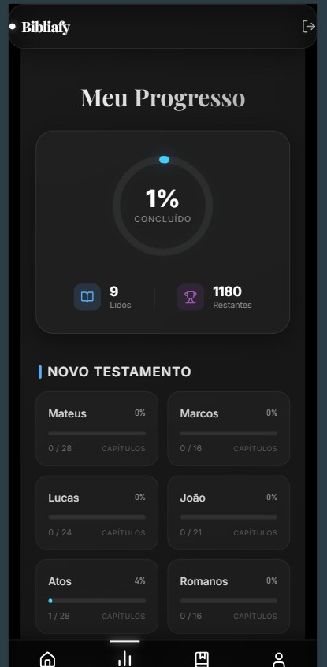

# 📖 Bibliafy - Leitura Bíblica Gamificada


**Bibliafy** é uma aplicação web moderna para leitura da Bíblia, focada em oferecer uma experiência visual imersiva (Glassmorphism) e engajamento através de gamificação. O usuário acompanha seu progresso, ganha selos exclusivos por livro completado e gerencia suas anotações e favoritos.

## ✨ Funcionalidades Principais

* **📚 Leitura Imersiva:** Interface moderna com suporte a temas (Dark/Light/Sépia), ajuste de fonte e modo de foco.
* **🏆 Gamificação (Sistema de Selos):**
    * Ganhe selos exclusivos ao completar livros (ex: 👑 Coroa para Mateus, ❤️ Coração para João).
    * Alertas animados de conquista com efeitos de brilho e confete.
    * Galeria de conquistas no perfil do usuário.
* **📊 Estatísticas Detalhadas:**
    * Acompanhamento visual do progresso (Gráfico circular).
    * Status de leitura por livro (Novo e Velho Testamento).
    * Sincronização automática de histórico.
* **✨ UI/UX Premium:** Design **Glassmorphism** (efeito de vidro fosco), animações fluidas e menu flutuante estilo dock.
* **📝 Ferramentas de Estudo:**
    * Comparação de versículos entre versões.
    * Sistema de Favoritos.
    * Criação e gestão de Anotações pessoais.

## 🛠️ Tecnologias Utilizadas

### Frontend
* **React.js** (Vite)
* **React Router Dom** (Navegação)
* **Lucide React** (Ícones)
* **SweetAlert2** (Popups personalizados)
* **React Hot Toast** (Notificações)
* **CSS3** (Variáveis, Flexbox, Grid, Animations, Backdrop-filter)

### Backend
* **Node.js** & **Express**
* **PostgreSQL** (Banco de dados relacional)
* **JWT** (Autenticação segura)
* **Cors** & **Dotenv**

## 📸 Screenshots


| Tela de Leitura | Estatísticas | Conquista Desbloqueada |
|:---:|:---:|:---:|
|  |  |  |

## 🚀 Como Rodar o Projeto

### Pré-requisitos
* Node.js instalado
* PostgreSQL instalado e rodando

### 1. Configuração do Banco de Dados
Crie um banco de dados no PostgreSQL e execute as queries de criação das tabelas (`users`, `books`, `verses`, `reading_history`, `completed_books`, etc).

### 2. Backend (API)

```bash
# Clone o repositório
git clone [https://github.com/seu-usuario/bibliafy.git](https://github.com/seu-usuario/bibliafy.git)

# Entre na pasta do backend (se estiver separado)
cd backend

# Instale as dependências
npm install

# Configure o arquivo .env
cp .env.example .env
# (Edite o .env com suas credenciais do banco de dados)

# Inicie o servidor
npm start
# O servidor rodará em http://localhost:3000 (ou sua porta configurada)
